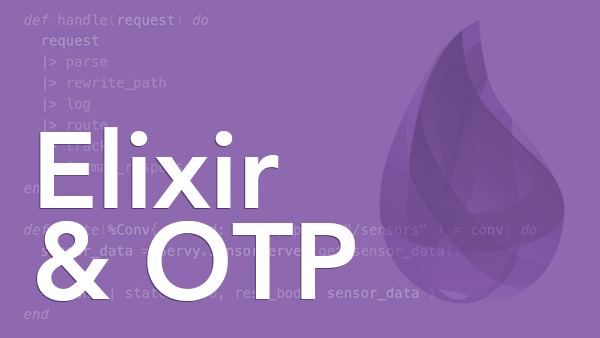

# Servy - Training Project from Pragmatic Studio



This repository contains the **Servy Project**, a hands-on learning exercise from the [Developing with Elixir/OTP Course by Pragmatic Studio](https://pragmaticstudio.com/courses/elixir). The project is designed to explore Elixir fundamentals and OTP concepts.

## Learning Modules

- [x] Introduction
- [x] Create Mix Project
- [x] High-Level Transformations
- [x] Pattern Matching
- [x] Immutable Data
- [x] Function Clauses
- [x] Advanced Pattern Matching
- [x] Pattern Matching Maps
- [x] Serving Files
- [ ] Module Attributes
- [ ] Organizing Code
- [ ] Modeling with Structs
- [ ] Matching Heads and Tails
- [ ] Recursion
- [ ] Slicing and Dicing with Enum
- [ ] Comprehensions
- [ ] A Peek at Phoenix
- [ ] Test Automation
- [ ] Rendering JSON
- [ ] Web Server Sockets
- [ ] Concurrent, Isolated Processes
- [ ] Sending and Receiving Messages
- [ ] Asynchronous Tasks
- [ ] Stateful Server Processes
- [ ] Refactoring Toward GenServer
- [ ] OTP GenServer
- [ ] Another GenServer
- [ ] Linking Processes
- [ ] Fault Recovery with OTP Supervisors
- [ ] Final OTP Application

## How to Run

Clone this repository and navigate to its directory:

```bash
git clone https://github.com/your-username/servy
cd servy
```

Install dependencies:

```bash
mix deps.get
```

Start the application:

```bash
mix run
```

## About the Course

The **Developing with Elixir/OTP** course by Pragmatic Studio is a comprehensive guide to mastering Elixir and OTP. Through a project-based approach.

Interested in learning Elixir? Check out the [course here](https://pragmaticstudio.com/courses/elixir). It's worth every penny! Plus, they offer a **Purchasing Power Parity Discount** based on your location to make it more affordable.
